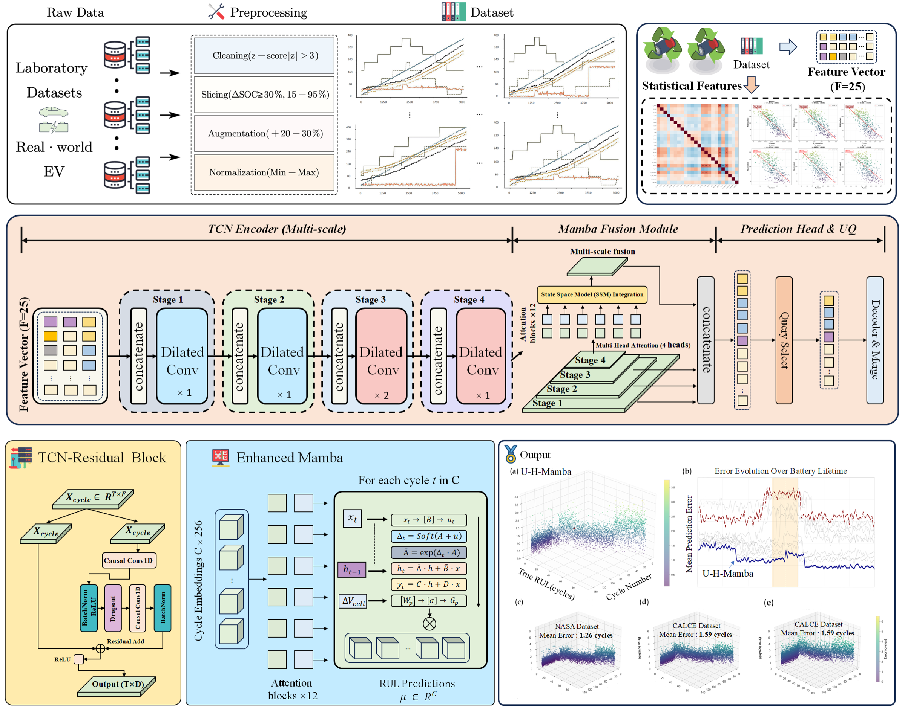
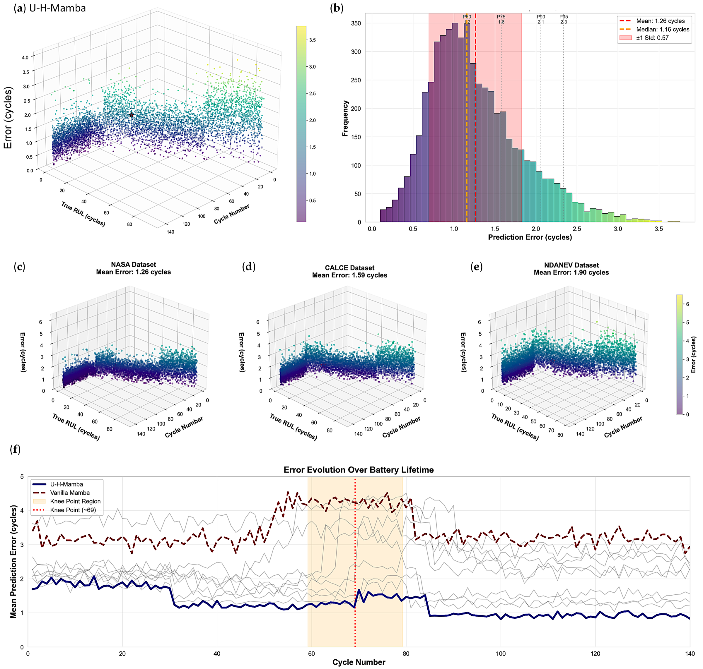

<div align="center">

# U-H-Mamba

**Uncertainty-aware hierarchical state-space modeling for battery RUL prediction**

[](https://doi.org/10.3390/en19020414)
[](https://doi.org/10.3390/en19020414)
[-7C3AED?style=flat-square)](#model-design)
[](#codebase-blueprint)

<sub>146k+ cycles · physics-informed features · calibrated uncertainty · cross-domain transfer</sub>

</div>

U-H-Mamba separates fast intra-cycle electrochemical dynamics from slow inter-cycle degradation, producing accurate RUL estimates together with calibrated prediction intervals.

## At a glance

| Input | Hierarchy | Reliability layer | Deployment target |
|:---|:---|:---|:---|
| 25 physical and virtual features | Multi-scale TCN → pressure-aware Mamba | MC Dropout + inductive conformal prediction | Edge BMS and fleet analytics |

| Laboratory benchmarks | Operational datasets | Training scale | Model footprint |
|:---:|:---:|:---:|:---:|
| NASA · CALCE · Oxford | NDANEV · BatteryML | **146k+ cycles** | **1.3 M parameters** |

## Model design

1. **Physics-informed preprocessing** — measured signals are combined with cumulative-energy and virtual-impedance proxies.
2. **Intra-cycle encoder** — dilated temporal convolutions compress high-frequency charge–discharge traces into cycle fingerprints.
3. **Inter-cycle decoder** — pressure-aware multi-head Mamba models long-range degradation with linear sequence complexity.
4. **Hierarchical fusion** — local electrochemical patterns and lifetime-level state evolution are aligned in a shared latent space.
5. **Uncertainty calibration** — Monte Carlo Dropout estimates epistemic variation; conformal recalibration controls interval coverage under domain shift.
6. **Transfer and interpretation** — low-data adaptation and SHAP analysis test robustness across laboratory and real-world conditions.

## Architecture

<p align="center">
  
</p>

## Published results

| NASA RMSE | NDANEV RMSE | Zero-shot lab → EV | 10% target fine-tuning |
|:---:|:---:|:---:|:---:|
| **3.2 cycles** | **5.4 cycles** | **6.4 ± 0.7 cycles** | **5.2 ± 0.5 cycles** |

| Overall coverage | Mean interval width | Inference latency | Parameters |
|:---:|:---:|:---:|:---:|
| **98.4 ± 0.8%** | **10.1 ± 1.1 cycles** | **0.09 s/sample** | **1.3 M** |

<p align="center">
  
</p>

## Codebase blueprint

```text
U-H-Mamba/
├── assets/                         # architecture and published results
├── configs/
│   ├── data/                       # dataset-specific feature profiles
│   ├── model/                      # encoder, decoder, and UQ settings
│   └── experiment/                 # transfer and ablation protocols
├── data/
│   ├── raw/                        # local benchmark archives
│   ├── processed/                  # cycle-aligned feature tensors
│   └── splits/                     # battery- and vehicle-level manifests
├── u_h_mamba/
│   ├── datasets/                   # NASA, CALCE, Oxford, NDANEV adapters
│   ├── models/
│   │   ├── tcn_encoder/            # multi-scale intra-cycle encoder
│   │   ├── mamba_decoder/          # pressure-aware state-space decoder
│   │   ├── feature_fusion/         # hierarchical feature alignment
│   │   └── uncertainty/            # MC Dropout prediction heads
│   ├── calibration/                # inductive conformal calibration
│   ├── transfer/                   # zero-shot and low-data adaptation
│   ├── evaluation/                 # RUL, EOL, knee-point, UQ metrics
│   ├── interpretability/           # SHAP and degradation analysis
│   └── utils/                      # logging, seeds, checkpoints, IO
├── scripts/                        # future train/evaluate/infer entry points
├── tests/
│   ├── unit/
│   └── integration/
└── README.md
```

The package directories are intentionally empty placeholders. Model implementation is not included in this release.

<details>
<summary><b>Citation</b></summary>

```bibtex
@article{wen2026uhmamba,
  title   = {U-H-Mamba: An Uncertainty-Aware Hierarchical State-Space Model for Lithium-Ion Battery Remaining Useful Life Prediction Using Hybrid Laboratory and Real-World Datasets},
  author  = {Wen, Zhihong and Liu, Xiangpeng and Niu, Wenshu and Zhang, Hui and Cheng, Yuhua},
  journal = {Energies},
  volume  = {19},
  number  = {2},
  pages   = {414},
  year    = {2026},
  doi     = {10.3390/en19020414}
}
```

</details>
