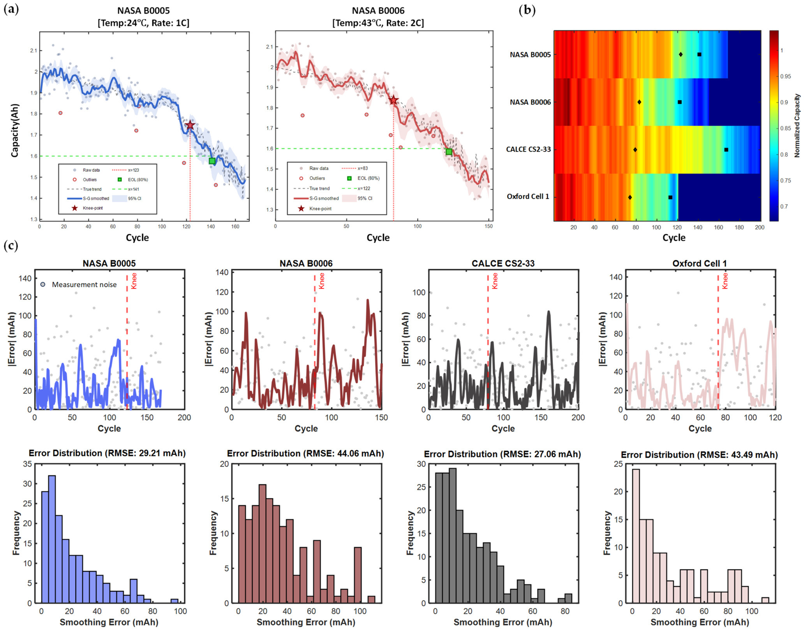
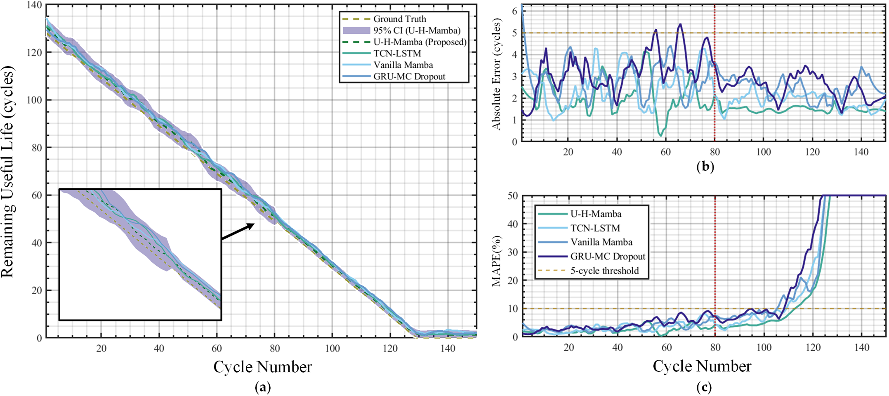
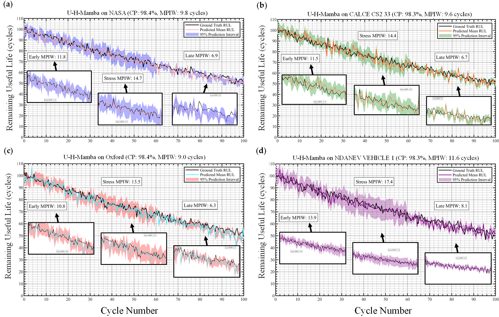
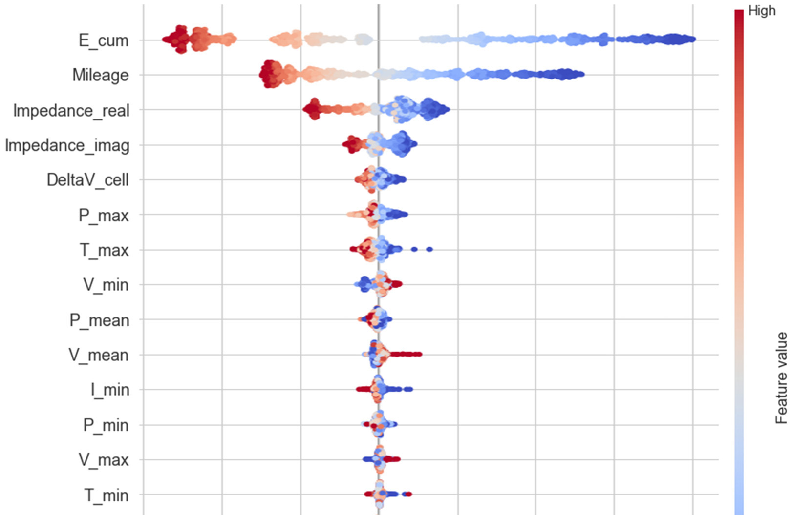
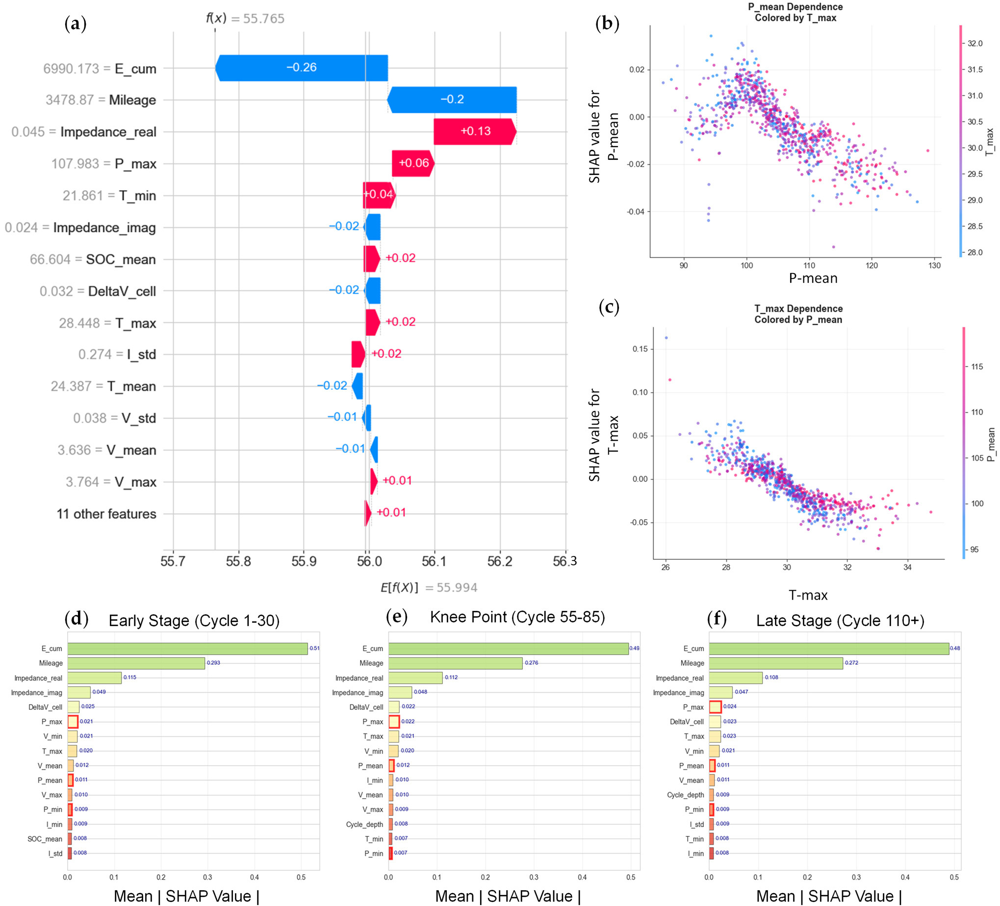

<div align="center">

# U-H-Mamba

**Uncertainty-aware hierarchical state-space modeling for battery RUL prediction**

[](https://doi.org/10.3390/en19020414)
[](https://doi.org/10.3390/en19020414)
[-7C3AED?style=flat-square)](#model-design)
[](#codebase-blueprint)

<sub>146k+ cycles · physics-informed features · calibrated uncertainty · cross-domain transfer</sub>

</div>

U-H-Mamba separates fast intra-cycle electrochemical dynamics from slow inter-cycle degradation, producing accurate RUL estimates together with calibrated prediction intervals.

The framework is designed for the domain gap between controlled laboratory cycling and operational electric-vehicle data. It combines measured electrical signals with cumulative-energy, virtual-impedance, and pressure-aware descriptors, then evaluates whether the learned degradation representation transfers across cells, datasets, and operating regimes without losing uncertainty awareness.

## At a glance

<table align="center">
  <tr align="center">
    <th>Input</th><th>Hierarchy</th><th>Reliability layer</th><th>Deployment target</th>
  </tr>
  <tr align="center">
    <td>25 physical and<br>virtual features</td>
    <td>Multi-scale TCN →<br>pressure-aware Mamba</td>
    <td>MC Dropout + inductive<br>conformal prediction</td>
    <td>Edge BMS and<br>fleet analytics</td>
  </tr>
</table>

<table align="center">
  <tr align="center">
    <th>Laboratory benchmarks</th><th>Operational datasets</th><th>Training scale</th><th>Model footprint</th>
  </tr>
  <tr align="center">
    <td>NASA · CALCE · Oxford</td><td>NDANEV · BatteryML</td><td><b>146k+ cycles</b></td><td><b>1.3 M parameters</b></td>
  </tr>
</table>

## Model design

1. **Physics-informed preprocessing** — measured signals are combined with cumulative-energy and virtual-impedance proxies.
2. **Intra-cycle encoder** — dilated temporal convolutions compress high-frequency charge–discharge traces into cycle fingerprints.
3. **Inter-cycle decoder** — pressure-aware multi-head Mamba models long-range degradation with linear sequence complexity.
4. **Hierarchical fusion** — local electrochemical patterns and lifetime-level state evolution are aligned in a shared latent space.
5. **Uncertainty calibration** — Monte Carlo Dropout estimates epistemic variation; conformal recalibration controls interval coverage under domain shift.
6. **Transfer and interpretation** — low-data adaptation and SHAP analysis test robustness across laboratory and real-world conditions.

## Architecture

U-H-Mamba separates within-cycle signal encoding from across-cycle degradation modeling. A multi-scale TCN extracts local electrochemical fingerprints, the enhanced Mamba block propagates long-horizon state evolution, and the uncertainty head couples Monte Carlo dropout with conformal recalibration.

This hierarchy gives each module a specific role. Dilated temporal convolutions summarize local voltage, current, temperature, impedance, and state-of-charge behavior; the pressure-aware state-space decoder tracks the slower transition toward the degradation knee and end of life. The final probabilistic layer reports both an RUL estimate and a calibrated interval, so predictive confidence can widen when the operating domain becomes less familiar.

<p align="center">
  <br>
  <sub>Figure 2. Hierarchical architecture and uncertainty-calibration workflow.</sub>
</p>

## Published results

<table align="center">
  <tr align="center">
    <th>NASA average RMSE</th><th>NDANEV overall RMSE</th><th>Zero-shot lab → EV</th><th>10% target fine-tuning</th>
  </tr>
  <tr align="center">
    <td><b>3.7 ± 0.4 cycles</b></td><td><b>5.8 ± 0.6 cycles</b></td><td><b>6.4 ± 0.7 cycles</b></td><td><b>5.2 ± 0.5 cycles</b></td>
  </tr>
</table>

<table align="center">
  <tr align="center">
    <th>Overall coverage</th><th>Mean interval width</th><th>Inference latency</th><th>Parameters</th>
  </tr>
  <tr align="center">
    <td><b>98.4 ± 0.8%</b></td><td><b>10.1 ± 1.1 cycles</b></td><td><b>0.09 s/sample</b></td><td><b>1.3 M</b></td>
  </tr>
</table>

The comparative evaluation places the proposed model against conventional sequence models across early, middle, and late degradation. The error landscape highlights the benefit of jointly modeling local cycle signatures, long-range state transitions, and calibrated uncertainty.

Across all datasets, U-H-Mamba achieved an average RMSE of 4.5 ± 0.5 cycles and an R² of 0.990 ± 0.003. Performance improved as more of the degradation trajectory became available, with NASA B0005 RMSE decreasing from 5.2 ± 0.6 cycles in the early phase to 2.2 ± 0.3 cycles in the late phase. On the operational NDANEV dataset, the overall RMSE remained 5.8 ± 0.6 cycles despite substantially greater environmental variability.

<p align="center">
  <br>
  <sub>Figure 7. Comparative performance across degradation stages.</sub>
</p>

### Degradation representation

Capacity trajectories, smoothed derivatives, and error distributions reveal how degradation signatures change around the knee point. These signals motivate the separation of fast intra-cycle dynamics from slow lifetime evolution.

The figure also shows why a single global trend is insufficient: voltage and capacity evolve smoothly over long horizons, whereas derivative-based indicators respond sharply to local transitions and measurement noise. Multi-scale encoding allows the model to retain both behaviors, using short-range fingerprints to detect emerging change and long-range state dynamics to stabilize lifetime prediction.

<p align="center">
  <br>
  <sub>Figure 3. Degradation trajectories and smoothing-error analysis.</sub>
</p>

### RUL trajectories

The predicted RUL curve remains close to the observed lifetime trajectory while retaining stable error behavior near the nonlinear transition region. Error and relative-error panels make the temporal failure modes directly inspectable.

Most deviations remain within a narrow cycle-level range, and the average error decreases after the knee is identified. This behavior is important because delayed adaptation around the knee can inflate remaining-life estimates precisely when maintenance decisions become time-sensitive. The trajectory view therefore complements aggregate RMSE by showing when errors occur and whether they persist.

<p align="center">
  <br>
  <sub>Figure 8. RUL prediction and error trajectories.</sub>
</p>

### Uncertainty calibration

Prediction intervals adapt to dataset-specific operating variability while maintaining high empirical coverage. Wider bands appear in noisier operational regimes, providing an explicit reliability signal instead of a point estimate alone.

Across the five evaluation settings, mean 95% coverage was 98.4 ± 0.8% with a mean interval width of 10.1 ± 1.1 cycles. Oxford Cell 1 produced the narrowest intervals, whereas NDANEV required wider bands to accommodate real-world operating variation. The calibration results indicate that the model becomes appropriately less confident under domain shift rather than expressing the same uncertainty everywhere.

<p align="center">
  <br>
  <sub>Figure 9. Calibrated prediction intervals across four datasets.</sub>
</p>

### Global interpretation

Global SHAP analysis ranks cumulative-energy, mileage, and impedance-related variables among the dominant contributors. The attribution pattern connects long-horizon usage exposure with measurable electrochemical degradation.

Cumulative energy and mileage carry the largest mean absolute contributions, followed by the real and imaginary components of impedance. This ordering is physically coherent with progressive throughput exposure, resistance growth, and loss of active lithium. Pressure-aware variables contribute additional information about swelling-related degradation, particularly when voltage and current profiles change across domains.

<p align="center">
  <br>
  <sub>Figure 10. Global feature attribution.</sub>
</p>

### Stage-specific interpretation

Local attribution views complement the global ranking by showing how feature influence changes between early, knee, and late degradation. This separates persistent drivers from stage-dependent effects.

The local panels show that identical feature values need not have the same effect throughout battery life. Usage accumulation dominates the long-horizon decline, while impedance, pressure proxies, and thermal variables become more influential around specific transition regions. This stage-dependent view helps distinguish a global correlate of aging from a feature that is informative only near a particular failure regime.

<p align="center">
  <br>
  <sub>Figure 11. Stage-specific SHAP analysis.</sub>
</p>

Published tables: [RUL performance](results/rul_performance.csv) · [uncertainty](results/uncertainty_quantification.csv) · [ablation](results/ablation.csv) · [transfer](results/cross_dataset_transfer.csv) · [data sensitivity](results/data_sensitivity.csv) · [efficiency](results/computational_efficiency.csv)

## Codebase blueprint

```text
U-H-Mamba/
├── assets/                         # architecture and published result figures
├── results/                        # machine-readable published tables
├── configs/
│   ├── data/                       # dataset-specific feature profiles
│   ├── model/                      # encoder, decoder, and UQ settings
│   └── experiment/                 # transfer and ablation protocols
├── data/
│   ├── raw/                        # local benchmark archives
│   ├── processed/                  # cycle-aligned feature tensors
│   └── splits/                     # battery- and vehicle-level manifests
├── u_h_mamba/
│   ├── datasets/                   # NASA, CALCE, Oxford, NDANEV adapters
│   ├── models/
│   │   ├── tcn_encoder/            # multi-scale intra-cycle encoder
│   │   ├── mamba_decoder/          # pressure-aware state-space decoder
│   │   ├── feature_fusion/         # hierarchical feature alignment
│   │   └── uncertainty/            # MC Dropout prediction heads
│   ├── calibration/                # inductive conformal calibration
│   ├── transfer/                   # zero-shot and low-data adaptation
│   ├── evaluation/                 # RUL, EOL, knee-point, UQ metrics
│   ├── interpretability/           # SHAP and degradation analysis
│   └── utils/                      # logging, seeds, checkpoints, IO
├── scripts/                        # future train/evaluate/infer entry points
├── tests/
│   ├── unit/
│   └── integration/
└── README.md
```

The repository now includes a dependency-light public utility layer for validated battery sequences, point and interval metrics, and finite-sample split-conformal calibration, with unit tests and CI. The trained hierarchical state-space model, checkpoints, and source datasets are not included in this release.

<details>
<summary><b>Citation</b></summary>

```bibtex
@article{wen2026uhmamba,
  title   = {U-H-Mamba: An Uncertainty-Aware Hierarchical State-Space Model for Lithium-Ion Battery Remaining Useful Life Prediction Using Hybrid Laboratory and Real-World Datasets},
  author  = {Wen, Zhihong and Liu, Xiangpeng and Niu, Wenshu and Zhang, Hui and Cheng, Yuhua},
  journal = {Energies},
  volume  = {19},
  number  = {2},
  pages   = {414},
  year    = {2026},
  doi     = {10.3390/en19020414}
}
```

</details>
